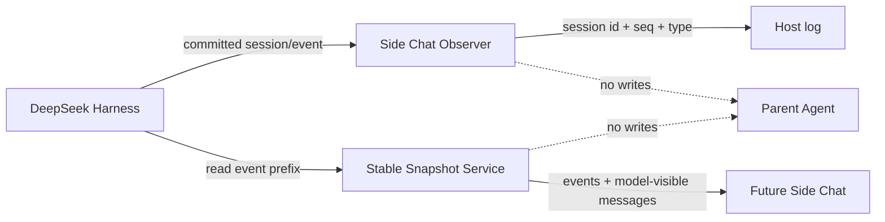

# dsh-sidechat

`dsh-sidechat` is an independent plugin for [DeepSeek Harness](https://github.com/deepseek-ai/deepseek-harness). Its long-term goal is an isolated, disposable side conversation that can explain an Agent's committed trajectory without changing the parent Agent unless the user explicitly promotes a conclusion.

The current executable milestone implements:

- installation as an out-of-tree DSH bundle;
- lifecycle proof through load and unload messages;
- read-only observation of committed `session/event` records;
- privacy-preserving event summaries that exclude prompts, message text, tool arguments, and tool results;
- immutable snapshots through the latest authoritative `turn/end` boundary;
- exact reconstruction of the model-visible message surface at that boundary.

It does not yet create Side Chat conversations, call an LLM, modify the DSH Web UI, steer an Agent, or persist plugin-owned state.

## Architecture



The observer receives events only after DSH appends them to the session log. The snapshot service finds the latest `turn/end`, copies only that closed prefix, and folds it with DSH's canonical surface rules. A turn that is still running is excluded. Existing snapshots are detached and frozen, so later parent activity cannot change them. Neither component calls `session.append()`, `agent.steer()`, or `agent.followup()`.

The host-side API is available as:

```ts
const snapshot = ctx.sideChatSnapshots.capture(sessionId)
```

`snapshot.events` contains the canonical prefix and `snapshot.messages` contains the exact model-visible surface reconstructed from that prefix. Before the first `turn/end`, both arrays are empty and `boundarySeq` is `null`.

## Requirements

- Node.js `^22.19.0` or `>=24`
- pnpm
- DeepSeek Harness `0.1.0-rc.7` or a compatible developer-preview build

## Develop

```powershell
pnpm install
pnpm run check
```

## Load from a local checkout

From the DeepSeek Harness checkout:

```powershell
pnpm dsh plugin --profile web add "C:\src\dsh-sidechat"
pnpm dsh web
```

After cloning or installing directly from GitHub, use:

```powershell
pnpm dsh plugin --profile web add github:Glaz-j/dsh-sidechat
```

Git dependencies build through the package's `prepare` script. pnpm 10 and newer may stop the first installation and print the exact codeload package key that must be added under `allowBuilds` in the profile's `pnpm-workspace.yaml`. Copy that key verbatim, set it to `true`, and repeat the installation command.

The host prints:

```text
[dsh-sidechat] plugin loaded (stable snapshot milestone)
```

Committed session activity produces metadata-only lines such as:

```text
[dsh-sidechat] session=<id> seq=12 event=tool/result
```

Remove the bundle with:

```powershell
pnpm dsh plugin --profile web remove dsh-sidechat
```

Maintainers with a local Harness checkout can run the isolated Loader smoke test by setting `DSH_HARNESS_ROOT`, then running `pnpm smoke:dsh`. The script boots a minimal real Cordis tree, loads the built bundle, commits a closed turn plus a later open turn, verifies the observer output and immutable snapshot boundary, and disposes the tree.

## Configuration

The bundle inserts this default row:

```yaml
- id: sidechat-observer
  name: dsh-sidechat
  config:
    observeEvents: true
    eventTypes: []
```

An empty `eventTypes` list observes every committed event type. Set an exact allowlist to reduce noise:

```yaml
eventTypes:
  - turn/start
  - step/start
  - tool/call
  - tool/result
  - step/end
  - turn/end
```

Set `observeEvents: false` to keep only the lifecycle proof.

## Roadmap

1. ✅ Stable snapshot at the last closed turn.
2. Single-turn isolated Side Chat.
3. Ephemeral multi-turn Side Chat with disposal.
4. Live committed-event snapshots.
5. Explicit discard, steer, and follow-up promotion.
6. Web conversation-node integration through public DSH extension points.

## License

[MIT](LICENSE)
