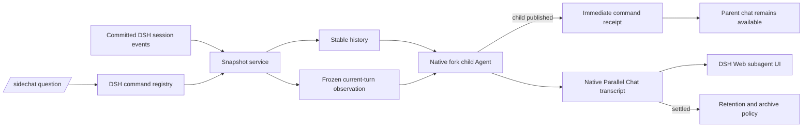

# DSH Parallel Chat

[中文](README.zh.md) | English

[](https://github.com/Glaz-j/dsh-parallel-chat/actions/workflows/ci.yml)
[](LICENSE)

Ask a private, read-only question about an active [DeepSeek Harness](https://github.com/deepseek-ai/deepseek-harness) task without interrupting the parent Agent.

> **Developer preview:** Parallel Chat is being released as an npm prerelease. Its core chat flow works with the official DSH developer preview; native archived-session visibility still has a host limitation. See [Compatibility](#compatibility).

## Why Parallel Chat?

- **Non-blocking:** the command returns as soon as the child Agent is published, so the main chat stays usable.
- **Context-aware:** the child receives stable parent history plus a frozen snapshot of visible messages already committed in the current turn.
- **Read-only by default:** the initial version exposes no tools to the child and cannot steer the parent Agent.
- **Native DSH experience:** Parallel Chat uses DSH child sessions, transcripts, status, cancellation, timing, token usage, and Web navigation.
- **Bounded lifecycle:** completed Parallel Chats stay visible for 30 minutes, with at most five retained per parent session.

## Quick start

### Install from GitHub

From a DeepSeek Harness checkout:

```powershell
pnpm dsh plugin --profile web add github:Glaz-j/dsh-parallel-chat
pnpm dsh web
```

Git dependencies run this package's `prepare` script. pnpm may pause the first install and show a codeload package key that must be allowed in the profile's `pnpm-workspace.yaml`. Add the exact key under `allowBuilds`, set it to `true`, and repeat the install.

### Install from npm

Install the prerelease with the `beta` tag:

```powershell
pnpm dsh plugin --profile web add dsh-parallel-chat@beta
pnpm dsh web
```

The `beta` tag makes the preview status explicit. npm is optional for DSH, but it provides a simpler and more reproducible installation than building a Git dependency.

## Use

Parallel Chat intentionally keeps the concise `/sidechat` command for invocation and compatibility.

Inspect the current snapshot without calling an LLM:

```text
/sidechat
```

Ask a one-shot question:

```text
/sidechat Why did the Agent choose this approach?
```

The parent composer unlocks immediately. Open the subagent list to watch the Parallel Chat run and read its answer.

Cancel the newest active Parallel Chat, or a specific request:

```text
/sidechat cancel
/sidechat cancel 12ab34cd
```

Remove the plugin with:

```powershell
pnpm dsh plugin --profile web remove dsh-parallel-chat
```

## What can Parallel Chat see?

Parallel Chat receives two immutable inputs:

1. **Stable history** through the latest authoritative `turn/end` boundary.
2. **Current-turn observation** containing visible events already committed when `/sidechat` was invoked.

The current-turn packet includes appended user messages, finalized assistant messages, and tool results. It excludes request headers, raw assistant chunks, command lifecycle events, runtime internals, and other non-visible records. The prompt packet is capped at 24,000 characters with deterministic middle truncation.

This is a capture-time snapshot. Parallel Chat does not continue following parent events after it starts.

## Isolation and privacy

- The private question is not recorded as parent chat input (`recordInput: false`).
- The child starts with an empty global tool allowlist (`allow: []`).
- The plugin never calls `agent.steer()` or `agent.followup()` on the parent.
- Parallel Chat cannot modify files, run commands, poll later parent activity, or inspect sibling subagents.
- DSH still owns and persists the native child transcript.

## Retention

Completed Parallel Chats remain in the plugin's retained set for 30 minutes. Each parent retains at most its five newest completed Parallel Chats; when a sixth settles, the oldest is archived immediately. Running children are never archived by the capacity rule.

Archival is non-destructive: the transcript stays persisted and the plugin no longer treats that child as retained. Startup reconciliation restores deadlines after a DSH restart. In official DSH `0.1.0-rc.7`, an archived child may remain visible in the native subagent list; see [Compatibility](#compatibility).

## Architecture



The command delegates through DSH's native `fork` subagent provider with a dedicated observer persona. DSH owns the Agent loop, child lineage, persistence, lifecycle events, and Web UI. The plugin owns snapshot construction, isolation policy, command receipts, cancellation, and retention scheduling.

The host-side snapshot API is:

```ts
const snapshot = ctx.sideChatSnapshots.capture(sessionId)
```

`snapshot.events` is the canonical closed prefix, `snapshot.messages` is the reconstructed model-visible surface, and `snapshot.currentTurn` contains capture metadata and filtered visible messages from the open turn.

## Requirements

- Node.js `^22.19.0` or `>=24`
- pnpm
- DeepSeek Harness `0.1.0-rc.7` or a compatible developer-preview build

## Compatibility

The core command, snapshot, fork, isolation, cancellation, scheduling, and persistence paths use public DSH plugin seams and work with the official DSH developer preview.

DSH `0.1.0-rc.7` does not currently filter plugin-archived sessions from its native subagent list and count. Consequently, Parallel Chat's retention policy still runs, but an archived transcript may remain discoverable through the host UI. A host-side experiment exists in the project's development fork, but no upstream change is required or assumed for this prerelease. Treat `0.1.0-beta.1` as an integration preview while this presentation gap remains.

## Configuration

The bundle adds this default configuration:

```yaml
- id: sidechat-observer
  name: dsh-parallel-chat
  config:
    observeEvents: true
    eventTypes: []
    subagentProvider: fork
    retentionMinutes: 30
    maxRetainedPerParent: 5
```

| Option | Default | Meaning |
| --- | ---: | --- |
| `observeEvents` | `true` | Emit metadata-only committed-event logs. |
| `eventTypes` | `[]` | Exact event allowlist; empty observes all types. |
| `subagentProvider` | `fork` | Context-inheriting provider with persona and tool-filter support. |
| `retentionMinutes` | `30` | Minutes a completed Parallel Chat remains visible. |
| `maxRetainedPerParent` | `5` | Completed Parallel Chats retained per direct parent. |

Set `observeEvents: false` to keep only lifecycle logs. Retention values must be positive integers.

## Development

```powershell
pnpm install
pnpm run check
```

To load a local checkout:

```powershell
pnpm dsh plugin --profile web add "C:\src\dsh-parallel-chat"
pnpm dsh web
```

Maintainers can run the real DSH loader smoke test by setting `DSH_HARNESS_ROOT` and running:

```powershell
pnpm smoke:dsh
```

## Distribution and discovery

DeepSeek Harness currently discovers community plugins through the GitHub [`dsh-plugin`](https://github.com/topics/dsh-plugin) topic rather than a curated registry submission form. Add the `dsh-plugin` topic to this repository so it appears alongside other community plugins.

DSH can install a plugin from GitHub, a local path, a tarball, or npm. Publishing to npm is therefore **not required**, but is recommended for stable releases because users receive a prebuilt, versioned artifact without Git install-time build approval.

## Current limitations

- One-shot Parallel Chats only; no follow-up messages inside a completed child.
- No dedicated Parallel Chat panel.
- No parent-bound read-only polling tools.
- No promotion of a Parallel Chat result into the parent conversation.
- No plugin-owned transcript format; persistence is delegated to DSH.

## Roadmap

- Parent-bound read-only status and event-query tools.
- Ephemeral multi-turn Parallel Chats with explicit disposal.
- Explicit discard and follow-up promotion.
- Host-independent archive presentation and a stable npm release.

## License

[MIT](LICENSE)
