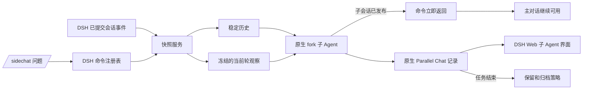

# DSH Parallel Chat

中文 | [English](README.md)

[](https://github.com/Glaz-j/dsh-parallel-chat/actions/workflows/ci.yml)
[](LICENSE)

在不打断主 Agent 的情况下，针对正在执行的 [DeepSeek Harness](https://github.com/deepseek-ai/deepseek-harness) 任务发起一次私密、只读的旁路问答。

> **开发者预览：** Parallel Chat 将以 npm 预发布版本上线。核心旁路问答流程可在 DSH 官方开发者预览版上运行；原生界面对已归档会话的展示仍有宿主限制。详见[兼容性](#兼容性)。

## 为什么需要 Parallel Chat？

- **不阻塞主对话：** 子 Agent 创建后命令立即返回，主对话可以继续使用。
- **理解当前上下文：** 子 Agent 会获得稳定历史，以及调用时当前轮已经提交的可见消息快照。
- **默认只读：** 第一版不给子 Agent 开放工具，也不会干预主 Agent。
- **复用 DSH 原生体验：** 使用 DSH 的子会话、记录、状态、取消、耗时、Token 统计和 Web 导航。
- **生命周期有边界：** 完成后保留 30 分钟，每个父会话最多显示最近 5 个 Parallel Chat。

## 快速开始

### 从 GitHub 安装

在 DeepSeek Harness 源码目录中执行：

```powershell
pnpm dsh plugin --profile web add github:Glaz-j/dsh-parallel-chat
pnpm dsh web
```

Git 依赖会执行本包的 `prepare` 构建脚本。pnpm 第一次安装时可能暂停，并提示一个需要放行的 codeload 包键。把提示中的完整键加入对应 profile 的 `pnpm-workspace.yaml` 之 `allowBuilds`，设为 `true`，然后重新执行安装命令。

### 从 npm 安装

使用 `beta` 标签安装预发布版本：

```powershell
pnpm dsh plugin --profile web add dsh-parallel-chat@beta
pnpm dsh web
```

`beta` 标签会明确提示这是预览版本。DSH 并不强制插件上线 npm，但 npm 安装比 Git 依赖的现场构建更简单、也更容易复现。

## 使用方法

Parallel Chat 仍使用简短的 `/sidechat` 命令，以方便调用并保持兼容。

只查看当前快照，不调用 LLM：

```text
/sidechat
```

发起一次独立问答：

```text
/sidechat 主 Agent 为什么选择这个方案？
```

子 Agent 发布后，主对话输入框会立刻恢复可用。你可以打开父会话顶部的子 Agent 列表，观察 Parallel Chat 的运行过程并查看回答。

取消最近一个正在运行的 Parallel Chat，或者取消指定请求：

```text
/sidechat cancel
/sidechat cancel 12ab34cd
```

卸载插件：

```powershell
pnpm dsh plugin --profile web remove dsh-parallel-chat
```

## Parallel Chat 能看到什么？

Parallel Chat 会收到两份不可变输入：

1. 截止最近一个权威 `turn/end` 边界的**稳定历史**。
2. 执行 `/sidechat` 时，当前轮已经提交的可见事件组成的**当前轮观察快照**。

当前轮快照会包含追加的用户消息、已经完成的助手消息和工具结果；不会包含请求头、助手原始分片、命令生命周期事件、运行时内部数据等不可见记录。注入提示词的内容上限是 24,000 个字符，超出后会采用确定性的中段截断。

这是调用时刻的冻结快照。Parallel Chat 启动之后，不会继续追踪主 Agent 后续产生的新事件。

## 隔离与隐私

- 私密问题不会作为父会话输入被记录（`recordInput: false`）。
- 子 Agent 的全局工具白名单为空（`allow: []`）。
- 插件不会对父 Agent 调用 `agent.steer()` 或 `agent.followup()`。
- Parallel Chat 不能修改文件、执行命令、轮询父 Agent 的后续活动或查看同级子 Agent。
- 原生子会话记录仍由 DSH 持有并持久化。

## 保留与归档

Parallel Chat 完成后会在插件的保留集合中保留 30 分钟。每个父会话最多保留最近 5 个已经完成的 Parallel Chat；第 6 个完成时，最旧的一个会立刻归档。正在运行的子 Agent 不会因数量规则而被归档。

归档不会删除数据：记录仍然持久化，插件只是不再把该子会话视为保留状态。DSH 重启后，启动协调逻辑会根据历史状态恢复归档截止时间。在官方 DSH `0.1.0-rc.7` 中，已归档子会话仍可能出现在原生子 Agent 列表里；详见[兼容性](#兼容性)。

## 架构



命令通过 DSH 原生 `fork` 子 Agent provider 发起任务，并注入专用的观察者 persona。DSH 负责 Agent 循环、父子关系、持久化、生命周期事件和 Web UI；插件负责构造快照、实施隔离策略、立即返回命令回执、取消任务和安排归档。

宿主侧快照 API 为：

```ts
const snapshot = ctx.sideChatSnapshots.capture(sessionId)
```

`snapshot.events` 是规范化的已关闭事件前缀，`snapshot.messages` 是重建出的模型可见消息面，`snapshot.currentTurn` 则包含当前开放轮的捕获信息和过滤后的可见消息。

## 环境要求

- Node.js `^22.19.0` 或 `>=24`
- pnpm
- DeepSeek Harness `0.1.0-rc.7` 或兼容的开发者预览版本

## 兼容性

命令、快照、fork、隔离、取消、定时和持久化流程使用的是 DSH 公开的插件接缝，可以在 DSH 官方开发者预览版上运行。

DSH `0.1.0-rc.7` 目前不会从原生子 Agent 列表和数量统计中筛掉由插件归档的会话。因此，Parallel Chat 的保留策略仍会正常执行，但已归档记录可能继续通过宿主界面被找到。项目的开发 fork 中保留了一份宿主侧实验补丁，不过本次预发布不要求、也不假设该补丁会进入上游。在这个展示差异解决以前，请把 `0.1.0-beta.1` 视为集成预览版。

## 配置

插件默认插入以下配置：

```yaml
- id: sidechat-observer
  name: dsh-parallel-chat
  config:
    observeEvents: true
    eventTypes: []
    subagentProvider: fork
    retentionMinutes: 30
    maxRetainedPerParent: 5
```

| 配置项 | 默认值 | 说明 |
| --- | ---: | --- |
| `observeEvents` | `true` | 输出只含元数据的已提交事件日志。 |
| `eventTypes` | `[]` | 精确事件白名单；空列表表示观察全部类型。 |
| `subagentProvider` | `fork` | 支持上下文继承、persona 和工具过滤的 provider。 |
| `retentionMinutes` | `30` | 已完成 Parallel Chat 保持可见的分钟数。 |
| `maxRetainedPerParent` | `5` | 每个直接父会话保留的已完成 Parallel Chat 数量。 |

把 `observeEvents` 设为 `false` 可以只保留生命周期日志。两个保留参数都必须是正整数。

## 本地开发

```powershell
pnpm install
pnpm run check
```

加载本地源码目录：

```powershell
pnpm dsh plugin --profile web add "C:\src\dsh-parallel-chat"
pnpm dsh web
```

维护者可以设置 `DSH_HARNESS_ROOT`，然后运行真实 DSH Loader 冒烟测试：

```powershell
pnpm smoke:dsh
```

## 发布与收录

DeepSeek Harness 目前通过 GitHub 的 [`dsh-plugin`](https://github.com/topics/dsh-plugin) Topic 发现社区插件，并没有单独的官方插件商店提交表单。给本仓库添加 `dsh-plugin` Topic 后，它就能进入社区插件的发现入口。

DSH 可以从 GitHub、本地路径、压缩包或 npm 安装插件，因此**不强制发布 npm**。不过正式版本仍推荐发布 npm：用户得到的是预构建、带版本号的制品，也不需要批准 Git 依赖的现场构建脚本。

## 当前限制

- 目前是一次性问答，已完成的 Parallel Chat 内不能继续追问。
- 还没有独立的 Parallel Chat 面板。
- 还没有绑定父会话的只读轮询工具。
- 不能把 Parallel Chat 的结果提升到主对话中。
- 不维护插件自己的记录格式，持久化完全交给 DSH。

## 路线图

- 绑定父会话的只读状态和事件查询工具。
- 支持显式销毁的临时多轮 Parallel Chat。
- 显式丢弃和追问结果提升。
- 实现不依赖宿主补丁的归档展示，并发布 npm 稳定版本。

## 许可证

[MIT](LICENSE)
